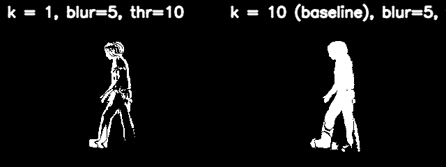
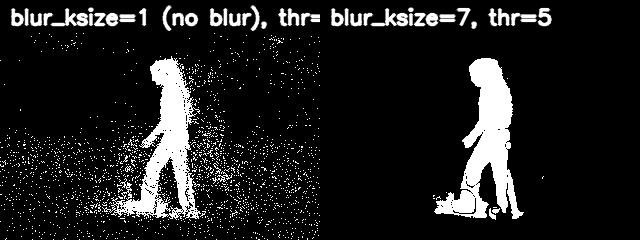
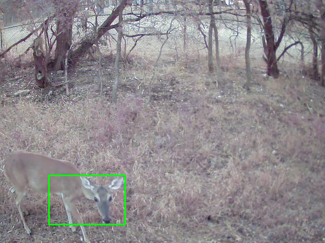

## Section 1: The Impact of Parameters on Motion Masks

### Experiment A: The Frame Offset (k)

Analysis A: Compare the k=1 mask to the baseline k=10 mask. Explain why the k=1 mask is so sparse and fragmented. What does this tell you about the speed of the person relative to the video's frame rate?

Mask k1 and k10 Comparison:

The k = 1 mask has less clusters than k = 10 mask so you see the mask looks sparse and fragmented when compared side-by-side. The person in k = 1 is moving slowly relative to the video's frame rate, so you only notice tiny changes around edges. If the person was moving faster, the mask would look fuller such as in k = 10 mask.

The k = 10 mask moves many pixels, so many regions change the intensity enough to clear the threshold making the mask look fuller.

### Experiment B: The Blur/Threshold Trade-off

Analysis B: Compare the "no blur" mask to the "blur" mask. Both use the same threshold, but the second one is much cleaner. Explain how applying a Gaussian blur to the input frames reduces the amount of noise in the final motion mask.

Threshold 5 Blur k1 and Threshold 5 Blur k7 Comparison:

The no blur mask has many tiny specks which then clutter the mask, while the blur mask smoothes out the tiny specks into the background resulting in the mask looking cleaner.

Applying Gaussian blur weights nearby pixels more, resulting in better smoothing. Blurring in general can remove a lot of noise, thro away details we want to ignroe, and create smoother images such as the blur k size 7 mask.

## Section 2: Failure Case Analysis

Bounding Box on Deer:

Question 1: The simple frame differencing algorithm is built on a key assumption about the scene. What is this assumption?

Answer: The simple frame differencing algorithm is built on the key assumption that nothing in the background will move (remain static), so any pixels that change are only from moving objects.

Question 2: Based on what you see in the failure case video, explain how this assumption is violated and why it causes the algorithm to fail.

In the deer video/frame, the background is not static. The background (grass, flowers, trees, etc.) are moving in the wind. SInce the background isn't static, there are a lot of pixels that change even when the deer barely moves in some frames. SImple differencing can't separate background motion form the deer, so this creates false postitives and false negatives. Therefore, the bounding box is unreliable in the failure case.

## Extra Credit: Advanced Motion Detection

LLM: ChatGPT

Prompt 1:

Task: Implement the function advanced_motion_detector(video_path), which takes a path to a video file and produces an output video showing the detected motion that does better than the simple frame differencing method. You are highly encouraged to use an LLM for research and to help generate the initial code for this.

The Result: A side-by-side comparison (GIFs or still images) showing the output of your simple detector vs. your advanced detector on the failure_case data. Save your output GIF in the output/ folder.

Prompt 2:

This is the starter code: # solution/advanced_detector.py import cv2 import numpy as np def advanced_motion_detector(video_path: str): """ Implements a robust background subtraction method to detect motion in a video. This function should process a video file, detect motion using a method more advanced than simple frame differencing, and display or save the result. Args: video_path (str): The path to the input video file. """ # --- YOUR EXTRA CREDIT CODE GOES HERE --- # You will need to open the video, loop through its frames, apply the # background subtractor, and possibly do some cleaning on the resulting mask. print(f"Processing video: {video_path}") print("Extra credit function is not yet implemented.") pass if **name** == '**main**': # You can use this section to test your advanced detector. # Example: # video_to_process = 'data/deer.mp4' # Assuming you create a video from the failure case frames # advanced_motion_detector(video_to_process) pass

Prompt 3:

Create the script for this new advanced detection code.

Side-by-Side Comparison GIF:

Simple frame differencing assumes a static background, so it confuses any vegetation and/or camera drift with motion. The advanced detection stabilizes the video to cancel camera drift, then uses an adaptive background model (MOG2) that learns normal background changes and ignores shadows. This results in fewer false-positives and tighter bounding boxes around the deer than the simple three-frame differencing in the normal motion detection code.
